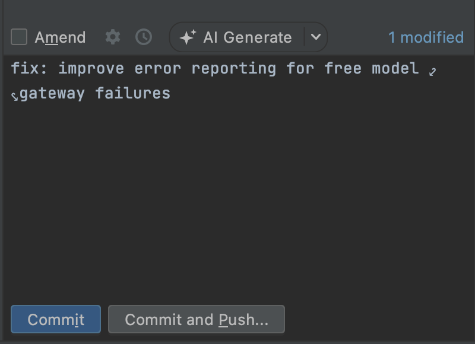
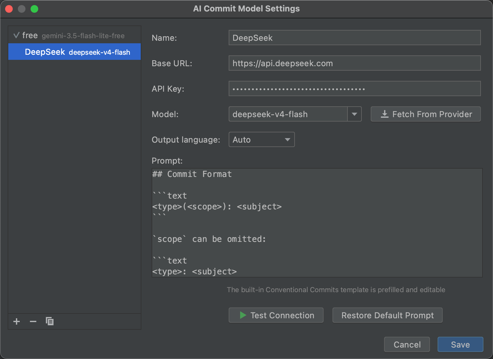

<div align="center">
  
</div>


[](./LICENSE)
[](https://plugins.jetbrains.com/plugin/33564-ai-commit-message)


# AI Commit Message

在 JetBrains IDE 的提交窗口中，使用 AI 根据已选择变更的 diff 生成清晰、简洁的 Conventional Commit 信息。

Generate clear and concise Conventional Commit messages from selected changes directly in the JetBrains IDE commit window.

<table>
  <tr>
    <td width="50%" align="center">
      
      <br>
      <sub>生成提交信息 · Generate a commit message</sub>
    </td>
    <td width="50%" align="center">
      
      <br>
      <sub>配置 AI 模型 · Configure the AI model</sub>
    </td>
  </tr>
</table>


### 目录结构

```
.
├── jetbrains-plugin/   # JetBrains IDE 插件（DevKit 模块）
│   ├── src/            # Java 源码
│   ├── resources/      # plugin.xml、图标、Prompt 模板等资源
│   └── ai-commit-message.iml
└── assets/             # Logo 与截图
```

后续其他 IDE / 编辑器的插件将以同级目录的形式加入。

### 功能

- 在提交信息工具栏中一键生成 commit message。
- 内置托管免费模型，无需配置 API Key。
- 支持 OpenAI 兼容接口，可配置 Base URL、API Key 和模型。
- 支持切换供应商与模型、自定义 Prompt 和输出语言。
- 默认按照 Conventional Commits 格式生成提交信息。
  
### 安装

在 JetBrains IDE 中打开 `Settings | Plugins | Marketplace`，搜索 `ai-commit-message`，然后点击 `Install`。

插件要求 JetBrains Platform 2020.3 或更高版本。


### Repository layout

```
.
├── jetbrains-plugin/   # JetBrains IDE plugin (DevKit module)
│   ├── src/            # Java sources
│   ├── resources/      # plugin.xml, icons, prompt templates
│   └── ai-commit-message.iml
└── assets/             # Logo and screenshots
```

Plugins for other IDEs and editors will be added as sibling directories.

### Features
- Generate a commit message from the commit toolbar with one click.
- Use publisher-hosted free models without configuring an API key.
- Connect to any OpenAI-compatible API with a custom base URL, API key, and model.
- Switch providers and models, customize the prompt, and select an output language.
- Generate commit messages in Conventional Commits format by default.


### Installation

Open `Settings | Plugins | Marketplace` in your JetBrains IDE, search for `ai-commit-message`, and click `Install`.

The plugin requires JetBrains Platform 2020.3 or later.
