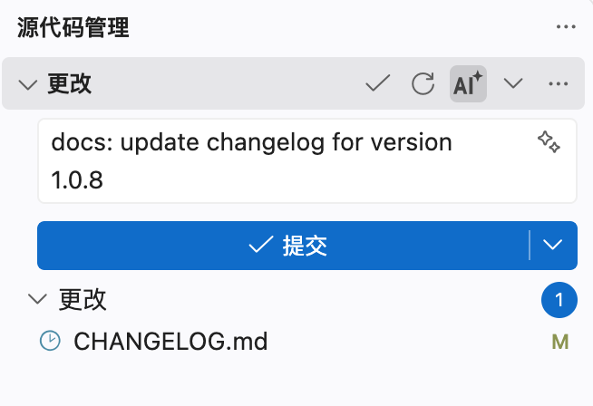
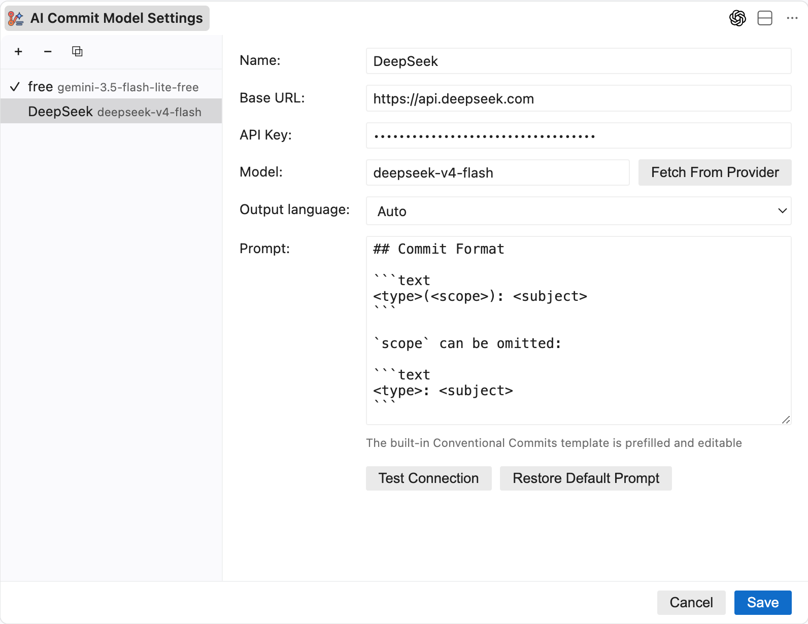

# AI Commit Message

使用 AI 根据变更 diff 生成清晰、简洁的 Conventional Commit 信息，支持 JetBrains 插件和 VS Code 插件。

Generate clear and concise Conventional Commit messages from your diff with AI, available as JetBrains and VS Code plugins.

<table>
  <tr>
    <td width="50%" align="center">
      
       
      JetBrains · 生成提交信息 · Generate a commit message
    </td>
    <td width="50%" align="center">
      
       
      JetBrains · 配置 AI 模型 · Configure the AI model
    </td>
  </tr>
  <tr>
    <td width="50%" align="center">
      
       
      VS Code · 生成提交信息 · Generate a commit message
    </td>
    <td width="50%" align="center">
      
       
      VS Code · 配置 AI 模型 · Configure the AI model
    </td>
  </tr>
</table>

## 功能 · Features

| 中文 | English |
| --- | --- |
| 在提交信息工具栏中一键生成 commit message | Generate a commit message from the commit toolbar with one click |
| 内置托管免费模型，无需配置 API Key | Use publisher-hosted free models without configuring an API key |
| 支持 OpenAI 兼容接口，可配置 Base URL、API Key 和模型 | Connect to any OpenAI-compatible API with a custom base URL, API key, and model |
| 支持切换供应商与模型、自定义 Prompt 和输出语言 | Switch providers and models, customize the prompt, and select an output language |
| 默认按照 Conventional Commits 格式生成提交信息 | Generate commit messages in Conventional Commits format by default |

## 安装 · Installation

### JetBrains IDE

在 JetBrains IDE 中打开 `Settings | Plugins | Marketplace`，搜索 `ai-commit-message`，然后点击 `Install`。

Open `Settings | Plugins | Marketplace` in your JetBrains IDE, search for `ai-commit-message`, and click `Install`.

> 要求 JetBrains Platform 2020.3 或更高版本。
>
> Requires JetBrains Platform 2020.3 or later.

### VS Code

在扩展面板搜索 `ai-commit-message-liubsyy` 安装，或使用 `code --install-extension ai-commit-message-liubsyy-<version>.vsix` 安装本地包。

Search for `ai-commit-message-liubsyy` in the Extensions view, or install a local package with `code --install-extension ai-commit-message-liubsyy-<version>.vsix`.

> 要求 VS Code 1.82 或更高版本。
>
> Requires VS Code 1.82 or later.

## 许可证 · License

[MIT](./LICENSE)
